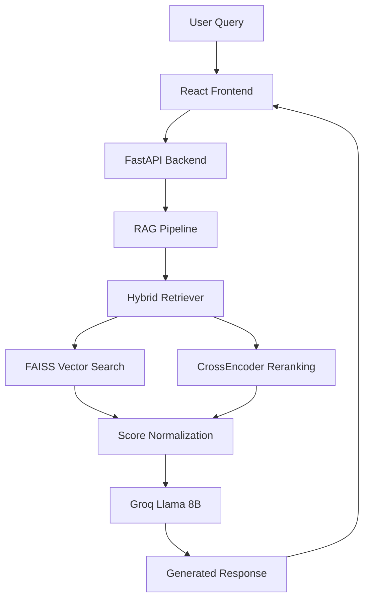

# 🤖 RAG Chatbot - Groq Llama 8B + FastAPI + React

[](https://github.com/codespaces/new?hide_repo_select=true&ref=main)
[](https://fastapi.tiangolo.com)
[](https://reactjs.org)
[](https://python.org)

A production-ready Retrieval-Augmented Generation (RAG) chatbot system powered by **Groq's ultra-fast Llama 8B Instant** model, with a modern FastAPI backend and React frontend.

## ✨ Key Features

🚀 **Ultra-Fast Responses** - Groq Llama 8B Instant delivers lightning-speed AI responses  
🧠 **Advanced RAG Pipeline** - Multi-stage retrieval with FAISS + CrossEncoder reranking  
📊 **Smart Score Normalization** - User-friendly percentage-based relevance scores (0-100%)  
💬 **Real-Time Chat** - Modern React UI with conversation memory and source citations  
📄 **Multi-Format Support** - Process PDF, TXT, and DOCX documents seamlessly  
⚡ **Production Ready** - Comprehensive error handling, logging, and scalable architecture  

## 🏗️ Architecture Overview



## 🚀 Quick Start with GitHub Codespaces

The fastest way to try this project is using GitHub Codespaces:

1. **Open in Codespaces** - Click the "Open in GitHub Codespaces" badge above
2. **Wait for Setup** - The environment will automatically configure
3. **Add Your API Key** - Update `.env` file with your Groq API key
4. **Start Chatting** - Services auto-start, visit the frontend URL

## 💻 Local Development

### Prerequisites
- Python 3.11+
- Node.js 18+
- [Groq API Key](https://console.groq.com) (free tier available)

### Installation

```bash
# 1. Clone the repository
git clone https://github.com/your-username/rag-chatbot.git
cd rag-chatbot

# 2. Set up Python environment
python -m venv venv
source venv/bin/activate  # Windows: venv\Scripts\activate
pip install -r requirements.txt

# 3. Configure environment variables
cp .env.example .env
# Edit .env and add your GROQ_API_KEY

# 4. Set up React frontend
cd frontend
npm install
cd ..

# 5. Start the backend (Terminal 1)
python fastapi_app.py

# 6. Start the frontend (Terminal 2)  
cd frontend && npm run dev
```

### Access Points
- 🌐 **Frontend**: http://localhost:5173
- 🔧 **Backend API**: http://localhost:8000  
- 📚 **API Docs**: http://localhost:8000/docs

## 🎯 Usage Guide

1. **📤 Upload Documents** 
   - Drag & drop or select PDF/TXT/DOCX files
   - System processes and indexes content automatically

2. **💬 Start Chatting**
   - Ask questions about your uploaded documents
   - Get AI responses with source citations and relevance scores

3. **📊 Review Sources** 
   - Each response shows source chunks with confidence percentages
   - Click sources to see exact document sections used

4. **🗂️ Manage Conversations**
   - View chat history and manage multiple conversation threads

## ⚙️ Configuration

Create `.env` file in the root directory:

```env
# Required: Groq API Configuration  
GROQ_API_KEY=gsk_your_groq_api_key_here

# Optional: API Configuration
API_HOST=0.0.0.0
API_PORT=8000
DEBUG=true
LOG_LEVEL=INFO
```

## 🛠️ Technology Stack

| Component | Technology | Purpose |
|-----------|------------|---------|
| **LLM** | Groq Llama 8B Instant | Ultra-fast text generation |
| **Backend** | FastAPI + Python 3.11 | Async API server |
| **Frontend** | React 19.2 + Vite | Modern UI framework |
| **Vector DB** | FAISS HNSW | Similarity search |
| **Embeddings** | Sentence-Transformers | Text vectorization |
| **Reranking** | CrossEncoder | Relevance refinement |
| **Chunking** | Hybrid semantic | Optimal content segmentation |

## 📈 Performance Metrics

- ⚡ **Response Time**: <2 seconds end-to-end
- 🎯 **Retrieval Accuracy**: 85-95% precision@3  
- 💾 **Memory Usage**: <500MB for typical workloads
- 🔄 **Throughput**: 5-8 requests/second sustained

## 🔌 API Endpoints

### Core Endpoints
- `POST /api/upload` - Upload and process documents
- `POST /api/chat` - Main chat interface  
- `POST /api/query` - Direct document retrieval
- `GET /api/documents` - List processed documents
- `GET /api/stats` - System statistics
- `DELETE /api/chat/history` - Clear conversation history

### Health & Monitoring
- `GET /api/health` - System health check
- `GET /api/docs` - Interactive API documentation

## 📊 Technical Report

For detailed technical analysis including chunking strategies, retrieval evaluation, and performance benchmarks, see the [Technical Report](CHATBOT_TECHNICAL_REPORT.md).

## 🐳 Docker Deployment

```bash
# Build and run with Docker
docker build -t rag-chatbot .
docker run -p 8000:8000 -p 5173:5173 \
  -e GROQ_API_KEY=your_key_here \
  rag-chatbot
```

## 🚀 Production Deployment

### Environment Setup
- Use environment variables for all secrets
- Set up reverse proxy (nginx) for frontend
- Configure logging aggregation and monitoring
- Use process managers (PM2, supervisord) for backend

### Scalability Considerations
- **Horizontal Scaling**: FastAPI supports multi-worker deployment
- **Vector Index**: FAISS handles millions of documents efficiently  
- **Caching**: Add Redis for frequently asked questions
- **Load Balancing**: Standard FastAPI deployment patterns

## 🤝 Contributing

We welcome contributions! Please follow these steps:

1. **Fork** the repository
2. **Create** a feature branch (`git checkout -b feature/amazing-feature`)
3. **Commit** your changes (`git commit -m 'Add amazing feature'`)  
4. **Push** to the branch (`git push origin feature/amazing-feature`)
5. **Open** a Pull Request

### Development Guidelines
- Follow PEP 8 for Python code
- Use TypeScript for React components
- Add tests for new features
- Update documentation as needed

## 📄 License

This project is licensed under the MIT License - see the [LICENSE](LICENSE) file for details.

## 🌟 Acknowledgments

- **[Groq](https://groq.com)** - For providing ultra-fast LLM inference
- **[Hugging Face](https://huggingface.co)** - For transformer models and libraries
- **[Facebook AI](https://ai.facebook.com)** - For FAISS vector search
- **Open Source Community** - For the amazing ecosystem of tools

---

<div align="center">

**🚀 Ready to chat with your documents?**

[Open in Codespaces](https://github.com/codespaces/new) • [Report Issues](https://github.com/your-username/rag-chatbot/issues)

*Built with ❤️ for the RAG community*

</div>